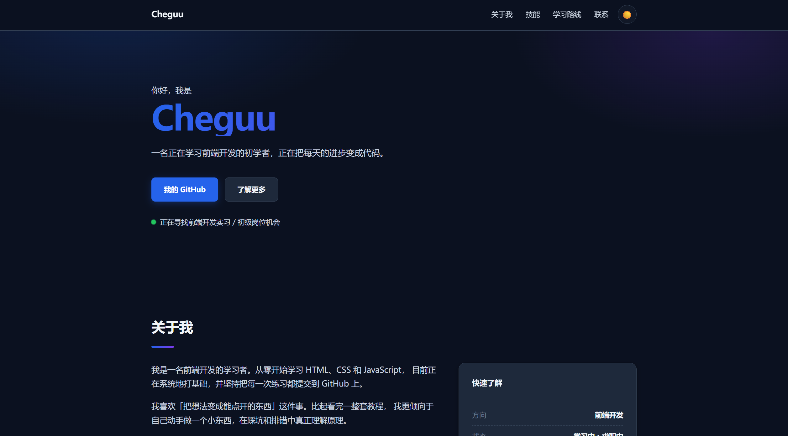

# personal-site

> 我的个人主页 —— 用纯 HTML / CSS / JavaScript 手写，用来记录学习和展示自己。

🔗 **在线预览**：https://qiangugu0226.github.io/personal-site/
<!-- 【部署后记得把上面这行改成真实地址，并把注释删掉】 -->


<!-- 【截图后把文件命名成 screenshot.png 放在本目录下】 -->

---

## 项目简介

这是我学前端后独立完成的第一个完整页面，也是我的个人名片。

它的作用不只是"展示"，更是我的练习场：响应式布局、CSS 变量、
深色模式、localStorage 持久化、无障碍属性，都是在这个页面里第一次真正用起来的。

## 功能

- [x] 响应式布局，手机 / 平板 / 桌面都能正常显示
- [x] 深色 / 浅色模式切换，并记住用户的选择
- [x] 首次访问自动跟随系统的深色模式设置
- [x] 平滑滚动导航
- [x] 学习路线时间线
- [x] 无障碍支持（aria 属性、支持系统「减少动态效果」设置）
- [ ] 待实现：导航滚动高亮当前区块
- [ ] 待实现：首屏打字机效果

## 技术栈


无任何框架和依赖，纯手写。

## 本地运行

```bash
git clone https://github.com/Qiangugu0226/personal-site.git
cd personal-site
```

然后用以下任一方式打开：

- **推荐**：在 VS Code 里右键 `index.html` → `Open with Live Server`（改代码自动刷新）
- 或者直接双击 `index.html`

## 项目结构

```
personal-site/
├── index.html          # 页面结构
├── css/
│   └── style.css       # 样式（含深色模式与响应式）
├── js/
│   └── main.js         # 主题切换、年份更新
├── screenshot.png      # 项目截图
├── .gitignore
└── README.md
```

---

## 遇到的问题和解决方式

### 一、深色模式切换后，刷新页面又变回浅色

**现象**：点击按钮能切换颜色，但一刷新就恢复原样。

**原因**：切换只是改了 DOM 属性，没有把选择保存下来；页面重新加载时又读取了默认值。

**解决**：用 `localStorage` 保存用户选择，页面加载时优先读取：

```js
function applyTheme(theme) {
  document.documentElement.setAttribute('data-theme', theme);
  localStorage.setItem(THEME_KEY, theme);   // 关键：保存下来
}

function getInitialTheme() {
  const saved = localStorage.getItem(THEME_KEY);
  if (saved) return saved;                  // 优先用上次的选择
  // 没有记录则跟随系统设置
  return window.matchMedia('(prefers-color-scheme: dark)').matches
    ? 'dark' : 'light';
}
```

**收获**：`localStorage` 存的是字符串，取值时要注意类型转换和空值判断。

### 二、手机上页面会横向滚动

**现象**：桌面端正常，手机上页面被撑宽，需要左右滑动。

**原因**：早期给容器设了固定宽度 `width: 1080px`，屏幕比它窄时就溢出了。

**解决**：改成「最大宽度 + 两侧内边距」，并给图片加自适应：

```css
.container {
  max-width: 1080px;   /* 最大不超过这个宽度 */
  margin: 0 auto;      /* 超出时居中 */
  padding: 0 24px;     /* 小屏幕时留出边距 */
}

img {
  max-width: 100%;     /* 永不溢出容器 */
  height: auto;        /* 保持比例不变形 */
}
```

**收获**：布局应该用 `max-width` 而不是 `width`，用相对单位而不是死像素。

### 三、锚点跳转时标题被吸顶导航挡住

**现象**：点导航跳到「技能」区块时，区块标题被顶部导航栏遮住了一截。

**原因**：导航栏用了 `position: sticky` 固定在顶部，锚点滚动到目标位置时不会自动避开它。

**解决**：给根元素加一行 `scroll-padding-top`：

```css
html {
  scroll-behavior: smooth;
  scroll-padding-top: 80px;   /* 留出导航栏的高度 */
}
```

**收获**：CSS 里有很多这类"一行解决一个具体问题"的属性，遇到问题先查有没有现成的属性，而不是急着用 JS 绕。

---

## 后续计划

- [ ] 加一个「项目作品」区块，用来放以后做的项目
- [ ] 导航滚动时高亮当前所在区块
- [ ] 补充一张截图到 README 顶部

## 联系方式

- 邮箱：guguchen0226@gmail.com
- GitHub：[@Qiangugu0226](https://github.com/Qiangugu0226)
